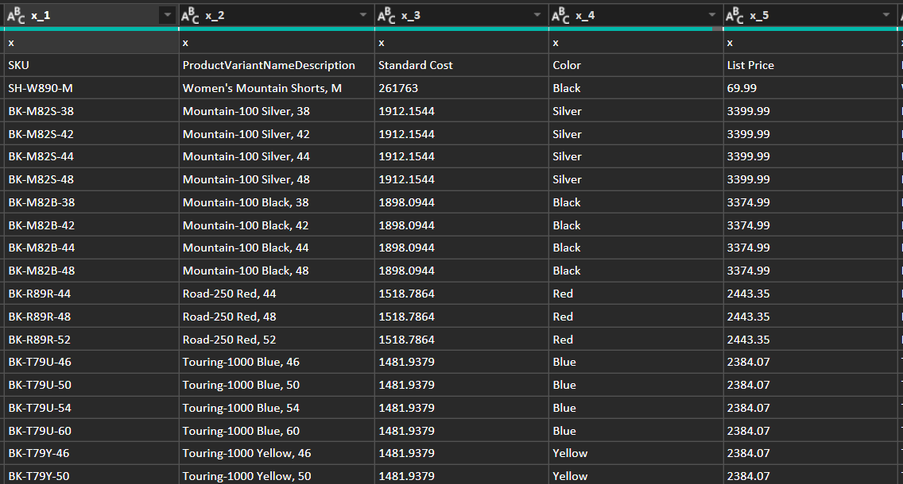
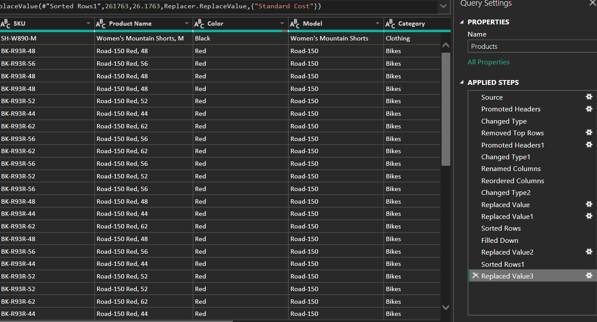

# Data Cleaning with Power Query

## 📂 Dataset
The dataset used in this project is based on the AdventureWorks sample data.

## 📊 Project Overview
This project demonstrates data cleaning and transformation techniques using Power Query in Power BI.

The goal is to prepare raw data for analysis by ensuring consistency, accuracy, and usability.

---

## 🧹 Data Cleaning Steps
The following transformations were applied:
- Corrected the table structure by promoting headers
- Adjusted data types to match the content of each column
- Removed unnecessary rows from the top of the dataset
- Renamed and reordered columns for better readability
- Replaced inconsistent or incorrect values
- Sorted the data to improve organization
- Filled down missing values where needed

## 📸 Project Screenshots

### Before Cleaning

The dataset initially contained unstructured data, incorrect headers, and inconsistent formatting, making it difficult to analyze.

### After Cleaning

After applying data cleaning and transformation steps in Power Query, the dataset is structured, consistent, and ready for analysis.
---

## 🛠 Tools Used
- Power BI
- Power Query

---

## 🎯 Key Skills Demonstrated
- Data cleaning and preprocessing
- Data transformation
- Handling text and numeric data
- Preparing datasets for analysis

---

## 🚀 Future Improvements
- Add visualizations in Power BI
- Perform exploratory data analysis
- Create dashboards

---

## 📌 Notes
This project is part of my journey to becoming a Data Analyst.
